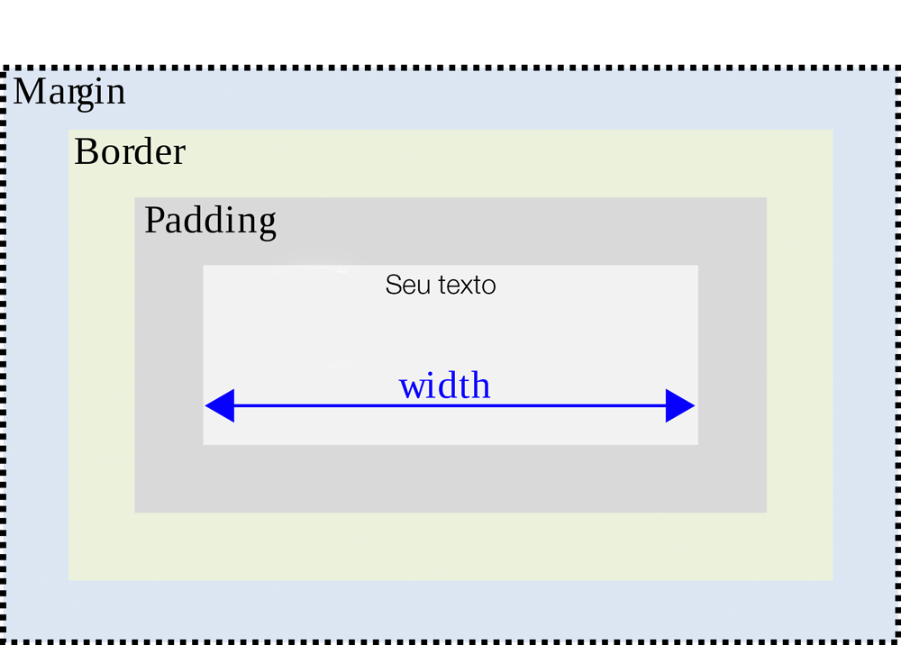

# CSS

## Adicionar css

* Inline: `<p style="color:red">Meu texto</p>`
* TAG style no head: `<style>...</style>`
* Importação: `<link rel="stylesheet" type="txt/css" href="style.css>`

## Sintaxe

```css
seletor {
    declaração: valor;
}
```

```css
/* CSS */
body {
    font-family: Arial;
    font-style: italic;
}

p {
    font-family: Courier;
}
```

## Cores

### Cor do texto

```css
p {
    color: #F6F6F6;
}
```

### Cor de fundo

```css
body {
    background-color: #F6F6F6;
}
```

## Fontes

```css
p {
    font-size: 40px;
    font-family: "Comic Sans MS";
}

body {
    font-family: Helvetica, Arial;
}
```

## Seletores

### Seleciona tudo

```css
* {
    margin: 0;
    padding: 0;
}
```

### ID

```css
#div_esquerda {
    background-color: red;
}

#div_direita {
    background-color: yellow;
}
```

```html
<div id="div_esquerda">asdf</div>
<div id="div_direita">asdf</div>
```

### Classe

```css
.container {
    width: 960px;
    margin: 0 auto;
}
```

```html
<div class="container"></div>
```

## Diferença entre margin e padding

Dada uma div, margin é a "margem externa" e padding é a "margem interna". Veja a figura a seguir:



## Alinhamento de Divs lado a lado

```css
#div_esquerda {
    background-color: red;
    min-height: 200px;
    width: 60%;
    float: left;
}

#div_direita {
    background-color: yellow;
    min-height: 200px;
    width: 40%;
    float: right;
}

footer {
    clear: both;
    background-color: blue;
    height: 50px;
}
```

```html
<div id="div_esquerda">asdf</div>
<div id="div_direita">asdf</div>

<footer>teste</footer>
```

## Imagem de fundo

```css
#principal {
    background-image: url('cidade.jpg');
    background-size: 100%;
    min-height: 500px;
}
```

## Sombra nos textos

```css
h1 {
    color: #FF7F50;
    text-shadow: 1px 1px 1px #111111;
    text-align: center;
    margin: 0 0 50px 0;
}
```

## Transparência

```css
.efeito {
    background-color: rgba(0, 0, 0, 0.5);
    padding: 100px 0 100px 0;
}
```

## Menu

```html
<header>
    <div class="container">
        <div id="logo">
            
        </div>

        <div id="menu">
            <a href="#">Home</a>
            <a href="#">Quem somos</a>
            <a href="#">Serviços</a>
            <a href="#">Fale conosco</a>
        </div>
    </div>
</header>
<div id="principal">

</div>
```

```css
#logo {
    float: left;
}

#menu {
    margin: 30px;
    float: right;
}

#menu a {
    padding: 50px 20px;
    text-decoration: none;
    color: #111;
    text-shadow: 1px 1px #111111;
}

#menu a:hover {
    background-color: #111;
    color: #35b8b0;
}

#principal {
    clear: both;
}
```