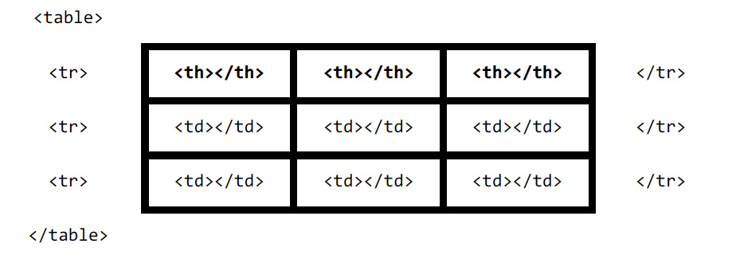

# HTML

## Template de uma página qualquer

Uma página HTML é composta por alguns elementos básicos. São eles: (i) a declaração do tipo do documento; (ii) a tag HTML, que armazenará todo conteúdo da página; (iii) o cabeçalho, que armazena informações estruturais da página; e (iv) o corpo, que armazenará os conteúdos e formatações da página.

```html
<!DOCTYPE html>
<html>
    <head>
        <title>Hello</title>
    </head>
    <body>
        <p>Olá, mundo!</p>
    </body>
</html>
```

Template completo com charset:

```html
<!DOCTYPE html>
<html lang="pt-br">

<head>
    <meta charset="utf-8">
    <title>Minha primeira página</title>
</head>

<body>
    <p>Olá mundo!</p>
</body>
```

## TAGS básicas

* `<p></p>` - parágrafo
* `<br>` - nova linha
* `<hr>` - linha horizontal
* `<h1></h1>` até `<h5></h5>` - cabeçalhos
* `<!-- TAGS -->` - comentários

## Parágrafos

* Tipos de formatações de parágrafos:

```html
<p>
    <b>Texto em negrito</b><br>
    <i>Texto em itálico</i><br>
    <u>Texto sublinhado</u><br>
    <sub>Texto subscrito</sub><br>
    <sup>Texto sobrescrito</sup><br>
    <big>Texto com fonte maior do que o padrão</big><br>
    <small>Texto com fonte menor do que o padrão</small><br>
    <em>Texto em itálico</em><br>
    <strong>Texto em negrito</strong>
</p>
```

* Alterando a fonte do texto:

```html
<!-- Declarando uma única fonte -->
<p style="font-family: 'Times New Roman'">Olá, mundo!</p>
 
<!-- Declarando duas possíveis fontes -->
<p style="font-family: 'Helvetica, Arial'">Olá, mundo novamente!</p>
```

## Estilos

No exemplo a seguir vamos demonstrar como alterar a cor de um texto:

```html
<style>
p { color: red; }
</style>
```

Podemos ainda aplicar cores ao fundo. Observe o exemplo a seguir:

```html
<style>
body { background-color: red; }
</style>
```

Agora vamos construir uma página completa aplicando estilos:

```html
<!DOCTYPE html>
<html>
<head>
    <title>Meus estilos</title>
    <style>
        body {
            background-color: red;
            color:green;
        }
    </style>
</head>
<body>
    <p>Olá mundo</p>
</body>
</html>
```

Veja que a tag `<style>` deve ser declarada dentro da tag `<head>`.

Perceba também que não é uma ideia muito boa, combinar vermelho com verde ;)

## Imagens

* `` - inserir imagens na página.

## Listas

Listas podem ser criadas usando a tag `<ul>` (listas não ordenadas) ou `<ol>` (listas ordenadas) e cada elemento pode ser inserido com a tag `<li>`.

```html
<!-- Lista ordenada -->
<ol>
<li>Primeiro elemento</li>
<li>Segundo elemento</li>
<li>Terceiro elemento</li>
</ol>
<!-- Lista não ordenada -->
<ul>
<li>Primeiro elemento</li>
<li>Segundo elemento</li>
<li>Terceiro elemento</li>
</ul>
```

## Links

* `<a href="http://google.com.br">Google</a>` - cria link para o Google

* `<a href="pagina2.html">Google</a>` - link relativo para a página 2

## Tabelas

Podemos criar tabelas usando a tag `<table>`.

Cada linha deve ser declarada com a tag `<tr>` e cada célula com a tag `<td>`.

Opcionalmente podemos usar a tag `<th>` para declarar células que representem a linha de cabeçalho.



## Estrutura de um website

Para que websites sejam bem desenvolvidos, existe um conjunto de tags que indicam onde cada conteúdo deve ser inserido. Em geral, essas tags são apenas estruturais, ou seja, ao serem inseridas, não trazem modificações no conteúdo da página.

Observe a seguir algumas tags estruturais:


 Destaco a tag `<div>`. Essa tag permite a inserção de divisórias nas páginas, ou seja, são tags estruturais que permitirão que você organize seu código.

```html
<div>
    <p>Conteúdo de uma div</p>
</div>
```

A seguir o código de uma página na estrutura mostrada acima:

```html
<!DOCTYPE html>
<html>
<head>

    <title>Página completa</title>
    <meta charset="UTF-8">

</head>

<body>

    <!-- Cabeçalho -->
    <header>

        <nav></nav>

    </header>

    <!-- Conteúdo -->
    <div>

        <article>
            <section></section>
        </article>

        <aside></aside>

    </div>

    <!-- Rodapé -->
    <footer></footer>

</body>

</html>
```

## Formulários

```html
<form action="processa.php" method="post">
    <label>Texto</label>
    <input type="text" name="texto1" placeholder="Digite o texto">

    <br>

    <label>Password</label>
    <input type="password" name="senha" placeholder="Digite a senha">

    <br>

    <label>Oculto</label>
    <input type="hidden" name="informacao_oculta" value="mensagem oculta">

    <br>

    <label>Select</label>
    <select name="selecao">
        <option value="1">Opção 1</option>
        <option value="2">Opção 2</option>
    </select>

    <br>

    <label>Radio</label>
    <br>
    <input type="radio" name="radio1" value="1"> Valor 1
    <br>
    <input type="radio" name="radio1" value="2"> Valor 2

    <br>

    <label>Checkbox</label>
    <input type="checkbox" name="ck1" value="1" checked> Valor 1
    <br>
    <input type="checkbox" name="ck1" value="2"> Valor 2
    <br>
    <input type="checkbox" name="ck1" value="3"> Valor 3
    <br>

    <input type="submit" name="submit" value="Enviar">
</form>
```